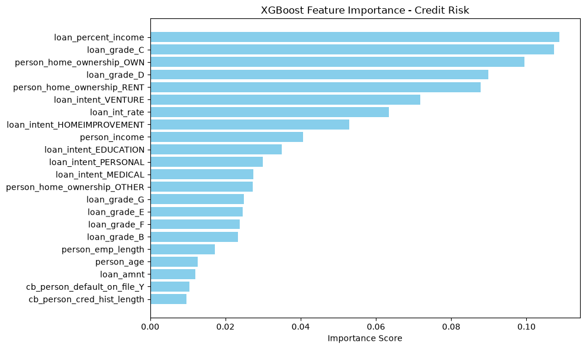

# 🏦 End-to-End Credit Risk Scoring Engine


## 📌 Project Overview
This project is an end-to-end machine learning pipeline and REST API designed to predict the probability of a customer defaulting on a loan. It bridges the gap between raw financial data and production-ready software by taking a trained **XGBoost** model and serving it via a **Django** web backend. 

Instead of relying on standard accuracy metrics—which are misleading in highly imbalanced financial datasets—this engine was optimized for **Precision, Recall, and ROC-AUC** to minimize the financial risk of False Negatives (approving bad loans).

## 📊 Business Logic & Feature Importance
Machine learning models shouldn't be black boxes. During the exploratory data analysis and model training phase, the XGBoost feature importance metrics revealed the strongest mathematical predictors for loan defaults:

1. **`loan_percent_income` (Debt-to-Income Ratio):** The model correctly identified that the percentage of income required to service the loan is the absolute strongest predictor of default risk.
2. **`loan_grade` (C & D):** The initial risk categorization assigned by the institution heavily correlates with the final outcome. 

<!-- IMAGE GOES HERE: Ensure your image is saved as 'feature_importance.png' in the same folder as this README -->


## 🏗️ Architecture & Tech Stack

*   **Data Engineering:** Pandas & Scikit-Learn (Handled missing data via median imputation and applied One-Hot Encoding to categorical variables).
*   **Machine Learning:** XGBoost Classifier (Tuned to handle severe class imbalances).
*   **Model Serialization:** Joblib (Exported both the model and the StandardScaler for production use).
*   **Backend API:** Django (RESTful endpoint designed to accept incoming JSON payloads, scale the data in real-time, and return a prediction).
*   **Frontend UI:** Vanilla HTML/JS (A lightweight, single-page interface to interact with the API).

## 🚀 API Endpoint Usage

The engine exposes a `/api/predict/` endpoint that accepts a user's financial profile and returns an immediate decision.

**Example Request:**
```bash
curl -X POST [http://127.0.0.1:8000/api/predict/](http://127.0.0.1:8000/api/predict/) \
-H "Content-Type: application/json" \
-d '{
    "person_age": 25,
    "person_income": 45000,
    "person_emp_length": 3.0,
    "loan_amnt": 15000,
    "loan_int_rate": 13.5,
    "loan_percent_income": 0.33,
    "cb_person_cred_hist_length": 4,
    "person_home_ownership_RENT": 1,
    "loan_intent_PERSONAL": 1,
    "loan_grade_C": 1
}'

**Example Response:**

{
    "status": "success",
    "risk_score": 38.49,
    "decision": "APPROVED"
}

**🛠️ How to Run Locally**

1. Clone the repository

git clone [https://github.com/vinay98485/credit-risk-engine.git](https://github.com/vinay98485/credit-risk-engine.git)
cd credit-risk-engine

2. Set up a virtual environment and install dependencies

python -m venv venv
source venv/bin/activate  # On Windows use: venv\Scripts\activate
pip install -r requirements.txt

3. Run the Django Server

python manage.py runserver

4. Launch the Interface
Open index.html directly in your web browser to access the dynamic frontend.


**👨‍💻 Author**

``Vinay kumar``

    Computer Science Engineering (Class of 2026)

    Specializing in Python, AI/ML, and Full-Stack Development